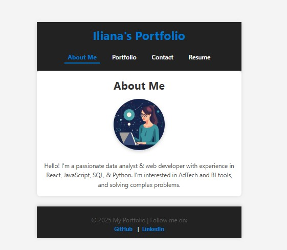

# 🎨 Iliana's React Portfolio

Welcome to my **React Portfolio!** 🚀 This project showcases my work as a **data analyst & web developer**, with experience in **React, JavaScript, SQL, and Python**. I am passionate about **AdTech, BI tools, and solving complex problems**.

## 🌐 Live Demo
🔗 [View My Portfolio on Netlify](https://your-netlify-url.netlify.app)  
*(Replace with your actual Netlify URL after deployment.)*

---

## 📂 Project Features
✅ Built with **React.js** & **Vite** for fast performance  
✅ Fully responsive, **mobile-friendly** design  
✅ **Portfolio Page** showcasing my projects  
✅ **Downloadable Resume** in PDF format  
✅ **Contact Form** with validation  
✅ **Navigation Bar** with routing using `react-router-dom`  

---

## 🖼️ Screenshots
  
*(Replace with an actual screenshot of your portfolio.)*

---

## 📂 GitHub Repository
🔗 [View the Source Code on GitHub](https://github.com/iaplesnyc/react-portfolio)

---

## 🛠️ Installation & Setup
If you’d like to run this project locally, follow these steps:

### **1️⃣ Clone the Repository**
```sh
git clone https://github.com/iaplesnyc/react-portfolio.git
cd react-portfolio
